# 0725南昌具身智能培训教程--仿真篇

本教程基于Rlbench和V-Rep, 学习仿真环境下的具身智能任务设计--任务验证--数据采集--模型训练完整流程.

## 第零章: 配置环境

*本教材适用于Ubuntu20.04/22.04*

1. 下载 CoppeliaSim

```bash
# 设置环境变量
export COPPELIASIM_ROOT=${HOME}/CoppeliaSim
export LD_LIBRARY_PATH=$LD_LIBRARY_PATH:$COPPELIASIM_ROOT
export QT_QPA_PLATFORM_PLUGIN_PATH=$COPPELIASIM_ROOT

# 选择1: 官网下载对应版本 (适用于Ubuntu20.04和22.04)
wget https://downloads.coppeliarobotics.com/V4_1_0/CoppeliaSim_Edu_V4_1_0_Ubuntu20_04.tar.xz

# 选择2: 百度网盘下载对应版本 (适用于Ubuntu20.04和22.04)
# https://pan.baidu.com/s/1RcKr2b27SjuXecAx3YkCug?pwd=6666

mkdir -p $COPPELIASIM_ROOT && tar -xf CoppeliaSim_Edu_V4_1_0_Ubuntu20_04.tar.xz -C $COPPELIASIM_ROOT --strip-components 1
rm -rf CoppeliaSim_Edu_V4_1_0_Ubuntu20_04.tar.xz
```

2. 下载本教程代码仓库, 并安装conda环境

```bash
git clone https://github.com/tanhuajie/NC-EXP.git
cd NC-EXP

conda create -n rlbench python=3.10
conda activate rlbench
pip install -r requirements.txt
```

3. 测试是否环境正常

```bash
export PYTHONPATH=$(pwd):$PYTHONPATH
export PATH=$COPPELIASIM_ROOT/bin:$PATH
python -m examples.single_task_rl
```

*若出现以下界面, 表示环境安装成功*

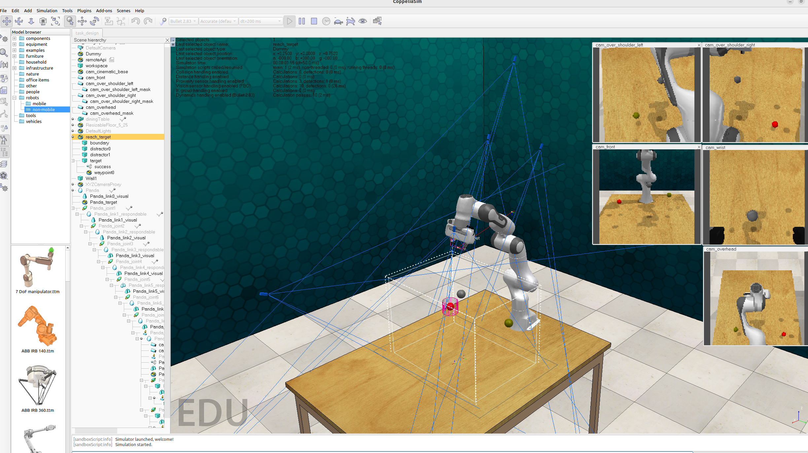

## 第一章: 简单任务构建流程

本文将以"slide_block_to_target"（将方块滑向目标）这一简单任务为例，完整演示任务构建的全过程。该任务要求Panda机器人将立方体滑到指定目标位置，成功执行后的效果如下：

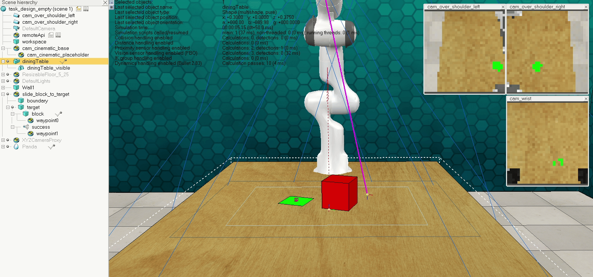

创建任务包含四个步骤：(1)通过任务构建器创建任务框架；(2)在V-Rep仿真器中添加场景物体；(3)编写Python控制文件；(4)通过任务验证器。后两步通常需要根据任务复杂度进行多次迭代调整。其中第二步需要先添加物理对象，然后添加用于检测对象的传感器（定义任务完成条件），最后添加用于计算机器人运动路径的路径点。第三步涉及创建各类对象句柄并定义成功条件。第四步是任务被纳入数据集的必要前提。

### 变体与轨迹集
此处需要说明轨迹集（episodes）与变体（variations）的概念。每个任务都关联多种文本描述，可用于机器人任务指令学习。下图展示了"toilet_seat_up"（掀起马桶盖）任务单变体的init_episode()函数返回的各种描述。理想情况下应涵盖描述同一任务的所有英语表达方式，例如"stack"（堆叠）任务的两个描述分别是"将其他杯子叠在红杯子上"和"拿起杯子放入红杯中"。

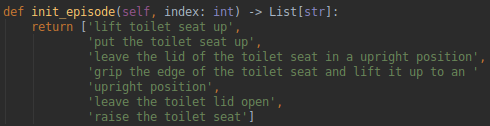

每个任务至少包含一个变体，每个变体必须包含多个轨迹集。"stack_cups"（堆叠杯子）任务根据基底杯子颜色设有多个变体，例如另一个变体描述为"将其他杯子叠在蓝杯子上"。变体不仅限于颜色变化："setup_checkers"（布置棋盘）的三个轨迹集分别要求摆放剩余1、2或3枚棋子。

*变体*定义为任务文本描述的特定语义版本，不同变体实际指示机器人执行略有差异的操作。*轨迹集*则定义为特定变体下任务对象的初始物理状态（主要是布局/位置），同一变体的不同轨迹集必须保持语义描述一致但物理状态不同。至少需要改变对象位置/方向，当前许多任务还会随轨迹集改变对象颜色和成功条件（同时调整机械臂动作指令）。

### 1 启动任务构建器
首先运行任务构建器，系统会自动打开新的V-Rep实例，该实例运行RLBench后端和Pyrep仓库中的代码。

```bash
python -m tools.task_builder
```

随后会提示输入任务名称，此处输入"slide_block"并按回车，确认创建新任务时输入"y"。构建器将在*rlbench/tasks*目录创建Python文件，在*rlbench/task_ttms*目录创建.ttm场景文件。下图展示了创建"slide_block"新任务时的构建器对话框：

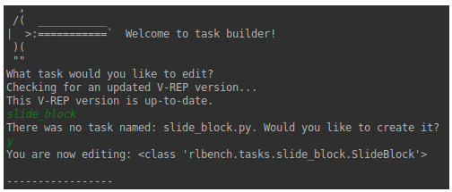

.ttm文件会自动加载到V-Rep实例，包含场景元素（墙壁、摄像头、工作台/边界、Panda机器人）和名为"slide_block"的任务虚拟对象。下图展示了包含"complex_task"空虚拟对象的初始场景task_design_empty.ttt：

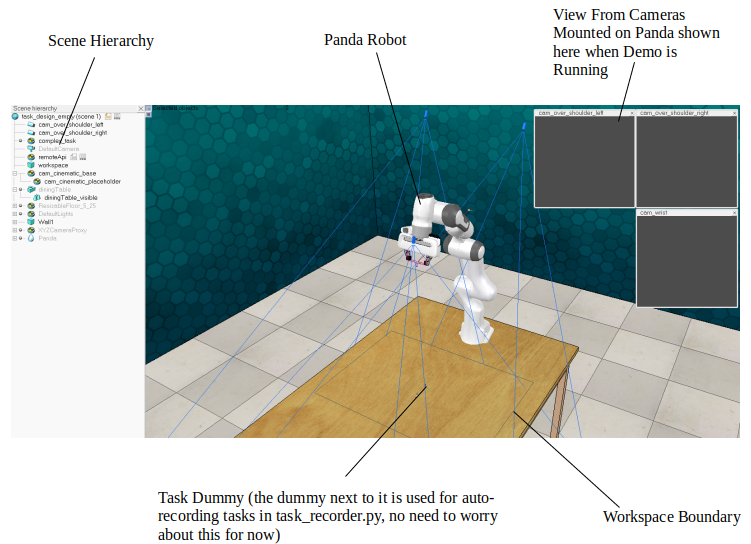

特别注意左侧场景层次结构，它以树状结构展示场景中所有对象的父子关系。关键点：(1)移动/旋转父对象会连带影响子对象；(2)所有任务相关V-Rep对象必须设为该虚拟对象的子项，而场景通用对象不应包含在此虚拟对象树下。这能确保任务保存时仅存入.ttm场景文件，且切换任务时能正确清除和加载对象。要调整层次结构，只需鼠标拖拽对象名称到目标父项即可。

### 2 在V-REP中创建任务
任务设计首先需要在RLBench的V-Rep实例中完成。我们将创建必要对象并设置其动力学和特殊属性。本任务需添加名为"block"的立方体和名为"target"的平面，这些对象必须放置在可操作区域内。

视图操作提示：点击左上角平移图标（下图）可拖动视图，点击右侧图标或鼠标滚轮可旋转视角。熟悉这些操作对多角度查看场景至关重要。

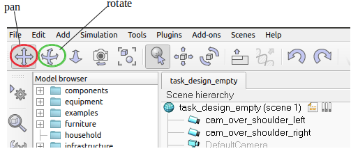

创建方块：顶部菜单Add -> Primitive Shape -> Cuboid，在弹出的对话框中设置各边长度为0.1米：

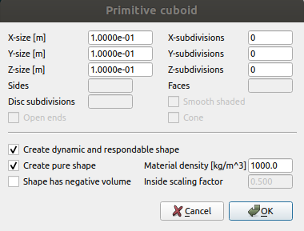

立方体默认灰色并生成在桌面下方。由于颜色将通过Python动态设置，此处暂不调整，但常规颜色设置方法如下：双击场景层次中的立方体打开属性对话框，在"Shape"属性页点击"Adjust color"或"Adjust texture"：

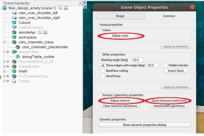

将立方体放置到桌面：点击左上角位置/平移图标，选择"Mouse Translation"标签，仅勾选Z轴方向（垂直移动）。按住Shift键可进行微调。其他轴向移动同理，当对象边界框方向非常规时可选择相对坐标系（后续教程详述）。

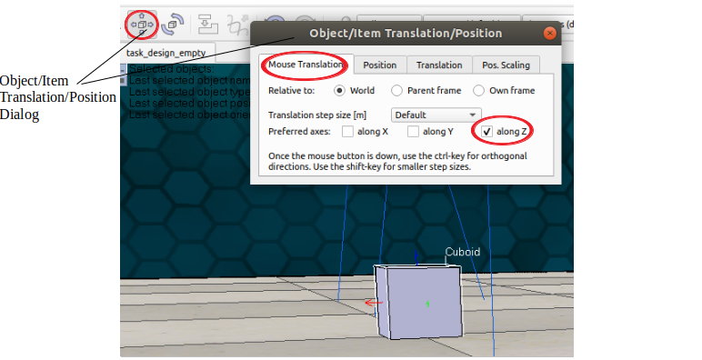

设置立方体*特殊属性*：双击打开属性对话框，在"Common"标签下勾选*Collidable*（可碰撞）、*Measurable*（可测量）、*Detectable*（可检测）和*Renderable*（可渲染）：

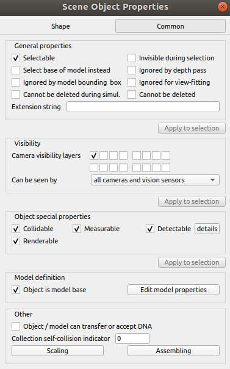

*可碰撞*属性使仿真器能检测对象间碰撞，对路径规划很重要；*可测量*启用对象间最小距离计算；*可检测*允许接近传感器感知对象；*可渲染*确保对象在训练时可见。

创建目标平面：Add -> Primitive Shape -> Plane，设置边长为0.1米并启用全部特殊属性。将其拖放到桌面，与立方体间隔约0.1米。平面需着色以显示实体表面而非线框，效果应类似下图：

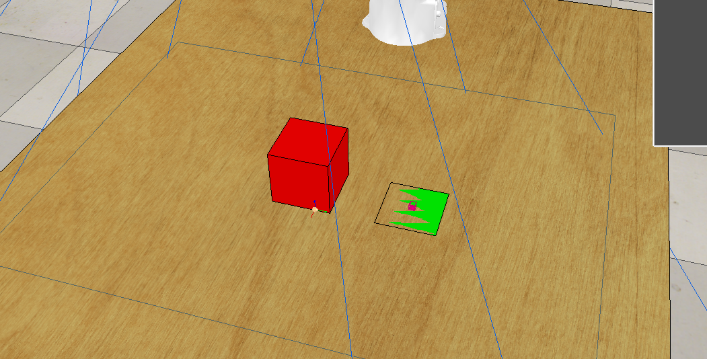

平面与桌面同高时可能出现部分视角不可见。在位置对话框的"Translation"标签中，Z轴输入"+1.00e-5"并点击"Z-translate sel."按钮，使平面略微高于桌面：

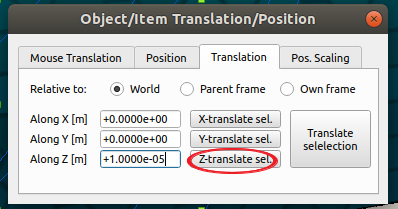

添加接近传感器：Add -> Proximity Sensor -> Pyramid Type。双击传感器打开属性对话框，点击"Show volume parameters"调整检测体积参数如下：

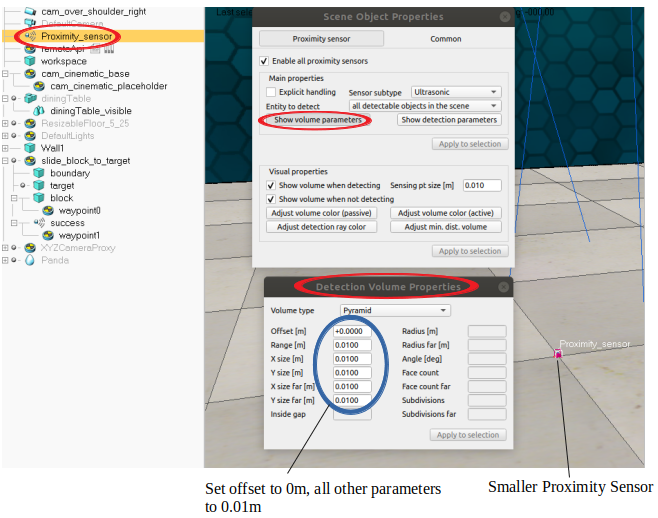

将传感器置于平面中心：先在层次结构中将其设为平面的子对象，然后在位置对话框设置相对父坐标系各轴为0。重命名为"success"。

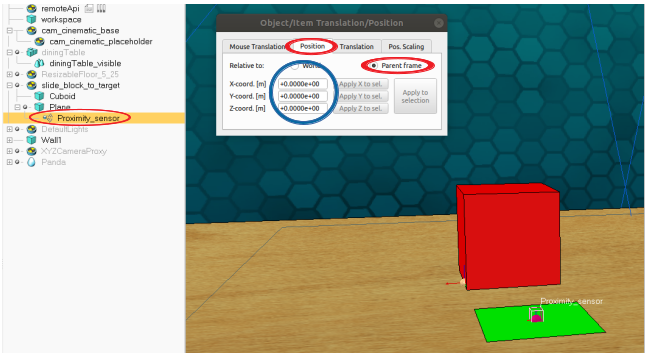

设置物理属性：立方体和平面都已设置全部特殊属性，立方体还需在动力学属性中启用*Respondable*（可响应）和*Dynamic*（动态）。打开立方体属性对话框的"Shape"标签，点击"Show dynamic properties dialog"，勾选对应选项。

添加路径点虚拟对象"waypoint0"和"waypoint1"：Add -> Dummy。将waypoint1设为传感器的子对象并设置相对位置为0；waypoint0设为立方体的子对象，Y轴相对位置设为-0.1米（位于立方体另一侧）。为避免路径规划绕行，为waypoint1添加扩展字符串"ignore_collisions()"：打开属性对话框的"Common"标签，在"Extension String"文本框中输入。

设置路径点方向：点击旋转/方向对话框图标，在"Orientation"标签设置世界坐标系下的方向参数（确保机械臂可达）：

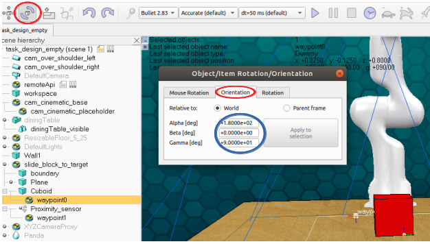

创建生成边界"boundary"：复制工作区（选中workspace后Ctrl+c/Ctrl+v），双击新对象打开属性对话框，点击"View/modify geometry"，取消"Keep proportions"后设置X/Y缩放系数为0.70：

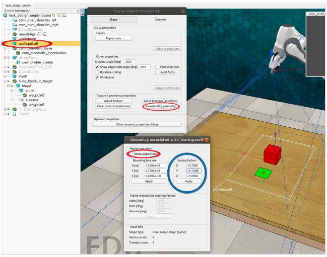

将workspace0设为任务虚拟对象的子项并重命名为"boundary"，确保所有新建对象都在其范围内。最终重命名：立方体→"block"、传感器→"success"、平面→"target"。确认父子层次结构如下：

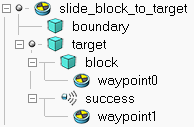

### 3 编写Python文件
完成场景文件后，打开*rlbench/tasks/slide_block_to_target.py*，初始包含以下空函数：

```python
from typing import List
from rlbench.backend.task import Task


class ComplexTask(Task):

    def init_task(self) -> None:
        ## TODO: 任务初始化时调用一次
        pass

    def init_episode(self, index: int) -> List[str]:
        ## TODO: 每个轨迹集开始时调用
        return ['']

    def variation_count(self) -> int:
        ## TODO: 返回任务变体数量
        return 1

    def step(self) -> None:
        ## 每仿真步调用（可选）
        pass

    def cleanup(self) -> None:
        ## 轨迹集结束时调用（可选）
        pass
```

函数说明：
- **init_task()** - 仿真器启动时调用一次，优先于其他函数
- **init_episode()** - 每个演示开始前调用，自动采样任务虚拟对象及其子项
- **variation_count()** - 返回变体总数
- **step()** - 每仿真步调用（可选）
- **cleanup()** - 轨迹集结束后重置场景（可选）

首先导入必要模块：
```python
from typing import List
from pyrep.objects.shape import Shape
from pyrep.objects.proximity_sensor import ProximitySensor
from rlbench.const import colors
from rlbench.backend.task import Task
from rlbench.backend.conditions import DetectedCondition
from rlbench.backend.spawn_boundary import SpawnBoundary
```

#### init_task() -> None:
初始化对象句柄和成功条件（跨轨迹集保持恒定）：
```python
self.block = Shape('block')
success_detector = ProximitySensor('success')
self.target = Shape('target')
self.boundary = SpawnBoundary([Shape('boundary')])
```

注册成功条件（方块被传感器检测到）：
```python
success_condition = DetectedCondition(self.block, success_detector)
self.register_success_conditions([success_condition])
```

#### init_episode(self, index: int) -> List[str]:
设置当前变体索引（多变体任务必需）：
```python
self._variation_index = index
```

根据变体索引设置方块颜色：
```python
block_color_name, block_rgb = colors[index]
self.block.set_color(block_rgb)
```

在边界内随机采样目标位置（连带其子对象）：
```python
self.boundary.clear()
self.boundary.sample(self.target)
```

返回当前变体的多语言描述（含颜色占位符）：
```python
return ['slide the %s block to target' % block_color_name,
        'push the %s cube to the white plane' % block_color_name,
        'nudge the %s block so that it covers the white target' % block_color_name,
        'Find the %s item on the table and manipulate its position so that it reaches the plane' % block_color_name]
```

#### variation_count(self) -> int:
返回颜色列表长度作为变体总数：
```python
return len(colors)
```

### 4 测试任务
完成场景和Python文件后，在构建器对话框输入"+"运行仿真器，"d"测试当前变体演示。通过"e"循环测试不同轨迹集，"v"测试不同变体。常见调整包括：修改对象位置/尺寸确保可操作性、调整生成边界参数、修改动力学属性（如质量）、优化路径点配置等。

### 5 通过任务验证器
在构建器对话框输入"!"运行验证器，任务需在所有变体下通过大多数测试才算成功。若未通过需返回步骤4调整，或考虑简化任务设计。

----

## 第二章: 进阶任务构建流程

本文将完整演示如何构建"Empty Container"(清空容器)这一复杂任务。完成本教程后，你将创建出类似下图的成果：


本教程假设你已掌握"简单任务构造流程"中的知识，请确保先完成该教程。与所有任务构建流程相同，我们将分阶段进行：(1)通过任务构建器创建任务，(2)在V-Rep模拟器中添加场景对象，(3)编写Python文件，(4)通过任务验证器。

除任务通用功能外，本任务还需实现：
* **动态采样与生成程序化对象** - 前提需从 https://sites.google.com/site/brainrobotdata/home/models 下载的各种小形状模型(.obj和.mtl文件)。要理解这些文件在仓库中的组织方式，请查看rlbench/assets/procedural_objects目录，其中包含每个对象的{*对象名*}和{*对象名*}*_coll文件。
* **设置目标容器颜色** - 目标容器颜色将随变体变化循环使用*rlbench/backend/const.py*中的颜色列表。
* **抓取功能** - 许多任务需要Panda机械臂抓取物体。我们将通过扩展字符串控制抓取功能。
* **动态重复路径点** - 每个需要移出大容器的物体都将复用同一组路径点，机械臂路径会为每个待移动物体重新计算。唯一区别在于抓取路径点*waypoint1*的位置，因此需要定义函数在每次重复时将该路径点重定位至新物体。
* **处理抓取失败** - 许多程序化物体形状不规则难以抓取。当机械臂在*waypoint1*抓取失败时，仍会完成可达路径（若无物体被抓取）。为提高演示成功率以通过验证器，我们将在*step()*函数中实时评估哪些物体已成功移动，并指示任务重新定位和重复路径点直到所有物体移入目标容器。
* **清理动态对象** - 演示开始前的场景状态必须与完成时一致。因此我们使用*cleanup()*函数在每次演示完成后从V-Rep场景移除所有程序化对象。

### 1 在V-Rep中创建场景
#### 创建大容器
首先通过创建5个独立立方体（容器各面）来构建大容器，然后将这些立方体编组以便在V-Rep和Python文件中作为单一对象处理。通过Add -> Primitive shape -> Cuboid创建立方体，尺寸设置如下：

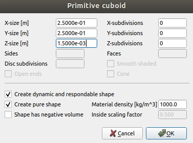

确认后将立方体重命名为*large_container0*，使其成为场景层次中*empty_container*虚拟体的子项，然后拖放至桌面。通过双击场景层次中的名称打开属性窗口，点击*Adjust color*，选择*Ambient/diffuse component*，按下图调整参数（RGB和HSL只需设置一种，另一种会自动调整）：

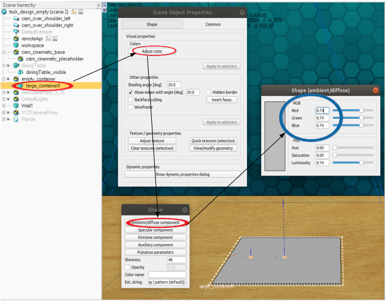

接着创建容器侧壁。添加尺寸为{*3.00e-01*, *6.00e-03*, *1.5e-03*}的立方体，在场景层次中选择后点击窗口左上角的旋转图标，设置其世界坐标系下的方向如下：

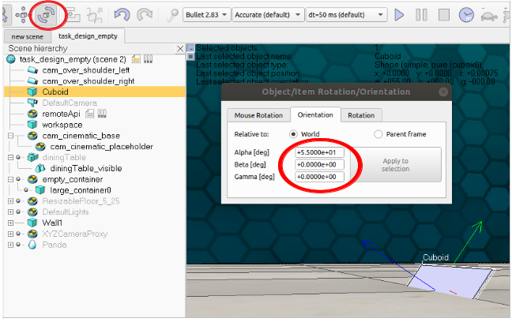

重命名为*large_container1*并设为*large_container0*的子项，通过鼠标平移对话框（仅勾选*沿Z轴*）将其移至桌面顶部，再通过*沿Y轴*平移使其边缘与容器基座对齐。此时场景和层次应如下：

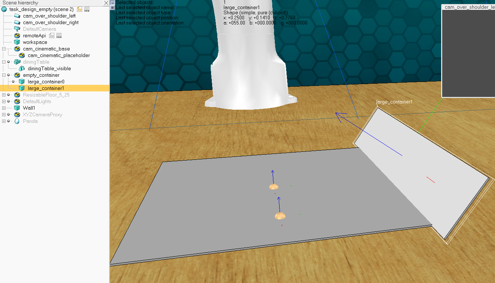

创建并定位剩余侧壁。复制*large_container1*（Ctrl+C/Ctrl+V）创建*large_container2*，设为任务虚拟体的子项。通过鼠标旋转对话框（*Relative to: World*，*绕Z轴*）将其逆时针旋转90度：

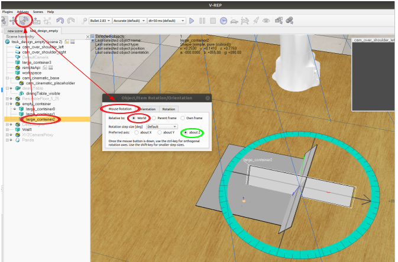

使用技巧定位第二面侧壁（前提是*large_container1*沿Y轴完美居中）：将*large_container2*相对于父坐标系的X坐标设为*large_container1*相对Y坐标的负值，Y坐标设为*large_container1*的X坐标值：

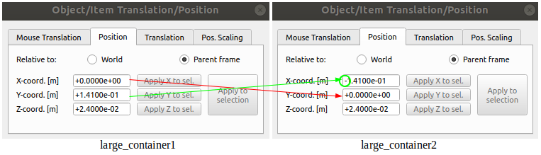

重复此过程创建定位剩余两面侧壁，最终效果如下：

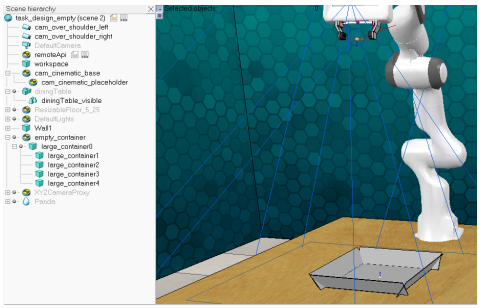

将所有大容器对象编组：按住Shift键依次选择各容器对象（最后点击*large_container0*），右键选择Edit->Grouping/Merging->Group selected shapes：

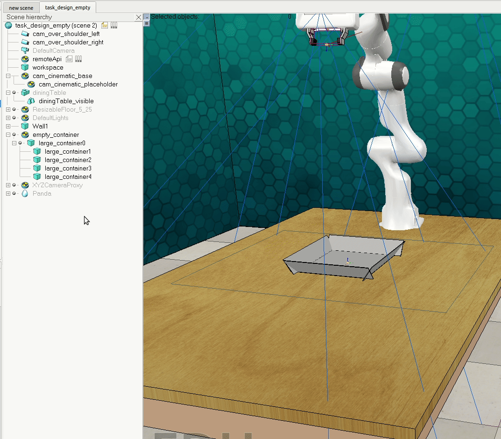

将生成的组重命名为*large_container*。在属性对话框的*Common*标签下设置所有4个*Object special properties*，确保勾选*Respondable*但不勾选*Dynamic*。

##### 关于编组与合并的说明
编组和合并都能将对象集合作为单一对象处理，但存在关键区别。如果合并会产生非凸对象，可能引发问题。但合并能创建更紧密的动态运动耦合关系（由重力等物理定律引起的运动）。例如将马克杯杯体和把手编组后，若抓取把手，杯体会分离。本任务中容器都禁用动态属性，因此编组或合并均可，仅为了方便作为单一对象处理。

##### 创建目标容器
请参照大容器的创建方法，构建名为*small_container0*和*small_container1*的两个小目标容器（参考首个gif动画）。区别在于：(1)目标容器壁的*Alpha*方向值设为90度（大容器为55度）；(2)位置在大容器两侧；(3)尺寸略小。建议先创建一个目标容器并定位后，再复制并镜像定位另一个。颜色将在Python文件中动态设置，此处无需配置。设置其*Object special*和*Dynamic*属性后，场景应如下：

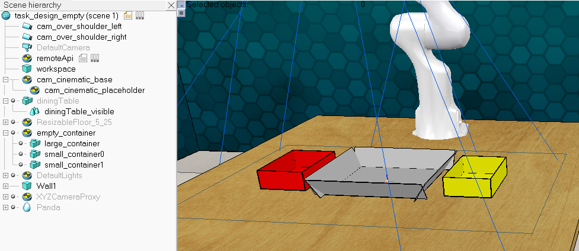

##### 添加接近传感器
添加两个能检测目标容器内所有物体的接近传感器。创建*Pyramid type*传感器，在属性对话框中点击*show volume parameters*，设置X/Y值与目标容器基底尺寸相同，*Range*设为容器壁高度，*Offset*设为0：

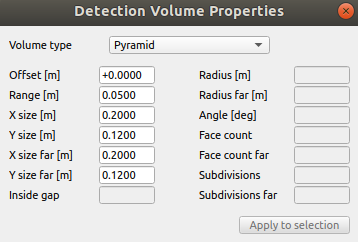

重命名为*success0*并设为*small_container0*的子项，相对位置全设为0。复制创建*success1*，同样设为*small_container1*的子项。

##### 添加路径点
需要创建4个路径点虚拟体：
* **waypoint0**：接近路径点，位于大容器基底中心上方约20cm处
* **waypoint1**：抓取路径点，位置将在Python文件中动态设置
* **waypoint2**：抬升路径点，位于与waypoint0相同位置
* **waypoint3**：释放路径点，位于*small_container0*或*small_container1*中心上方

创建虚拟体*waypoint0*，设为*large_container*的子项，相对位置设为{0, 0, 0.17}，世界坐标系下方向设为{180, 0, 180}。注意V-Rep有时难以将方向设为绝对0，可能显示极小值：

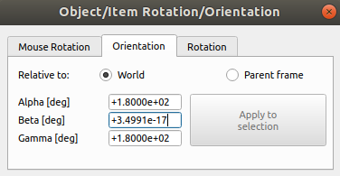

复制创建*waypoint1*，下移至*waypoint0*与桌面中间位置。再复制创建*waypoint3*和*waypoint4*，分别定位至*small_container0*上方和大容器上方。确保所有路径点都是*large_container*的子项，最终效果如下：

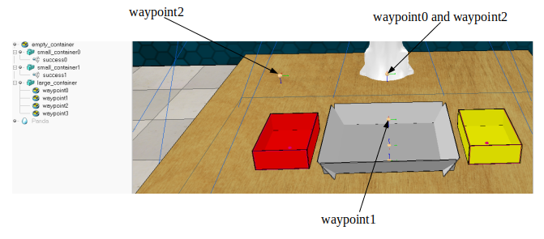

##### 扩展字符串
为部分路径点添加扩展字符串控制抓取动作。在属性对话框的*Common*标签下，*Extension String*文本框添加：
- *waypoint0*：`open_gripper(1.0)`
- *waypoint1*：`close_gripper();ignore_collisions`
- *waypoint2*：`ignore_collisions`
- *waypoint3*：`open_gripper()`

注意抓取路径点需设置`ignore_collisions`以避免物体相互遮挡导致的路径规划失败。

##### 添加生成边界
最后添加生成边界以在Python文件中动态生成程序化对象：

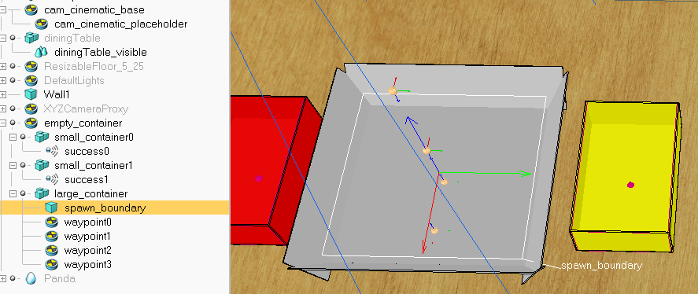

最简单的方法是复制工作区并使其中心对齐大容器：设为*large_container*的子项，相对位置设为0，沿Z轴平移至容器中间高度，重命名为*spawn_boundary*。调整其尺寸略小于大容器基底（通过*View/Modify geometry*对话框取消*Keep proportions*，调整X/Y值）。最后反转其可见层使其在任务中不可见（在属性对话框的*Common*标签下，取消第一行所有勾选，勾选第二行对应选项）：

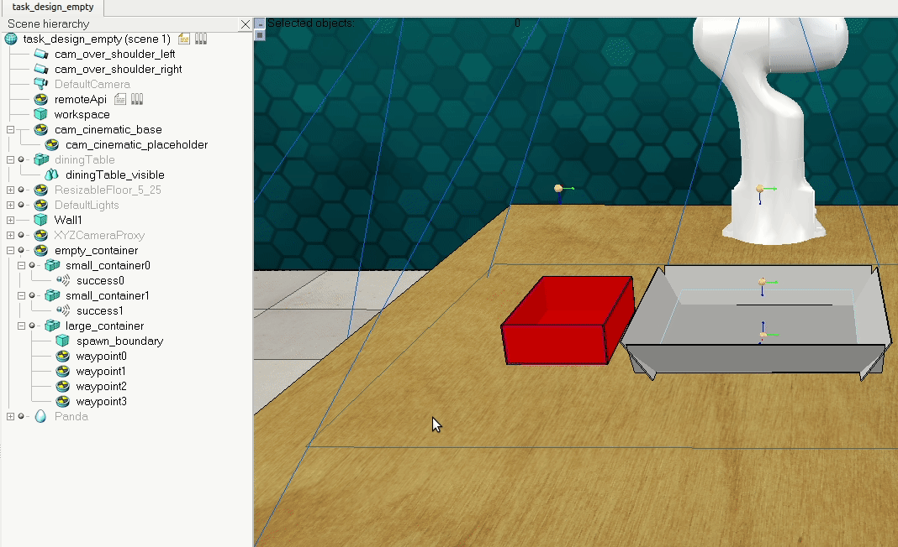

通过任务验证器保存.ttm文件（模拟未运行时输入's'）：

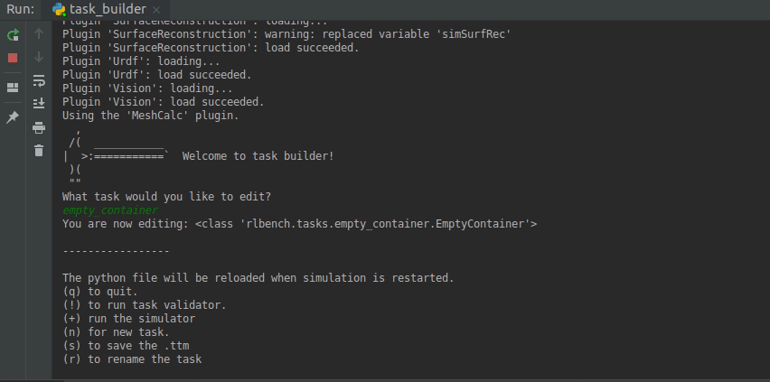

现在可以开始编写Python文件。

### 2 编写Python文件
#### 导入必要类
```python
from typing import List, Tuple
from rlbench.backend.task import Task
from rlbench.const import colors
from rlbench.backend.task_utils import sample_procedural_objects
from rlbench.backend.conditions import ConditionSet, DetectedCondition
from rlbench.backend.spawn_boundary import SpawnBoundary
import numpy as np
from pyrep.objects.shape import Shape
from pyrep.objects.proximity_sensor import ProximitySensor
from pyrep.objects.dummy import Dummy
```

#### init_task() -> None:
初始化对象句柄并注册路径点功能：
```python
self.large_container = Shape('large_container')
self.target_container0 = Shape('small_container0')
self.target_container1 = Shape('small_container1')
self.spawn_boundaries = [Shape('spawn_boundary')]
self.success_detector0 = ProximitySensor('success0')
self.success_detector1 = ProximitySensor('success1')
self.register_waypoint_ability_start(1, self._move_above_object)
self.register_waypoints_should_repeat(self._repeat)
```

#### init_episode(self, index: int) -> List[str]:
初始化每个episode：
```python
self._variation_index = index
self.bin_objects = sample_procedural_objects(self.get_base(), 5)
self.bin_objects_not_done = list(self.bin_objects)
self.register_graspable_objects(self.bin_objects)
```

动态生成程序化对象：
```python
b = SpawnBoundary(self.spawn_boundaries)
for ob in self.bin_objects:
    ob.set_position([0.0, 0.0, 0.2], relative_to=self.large_container, reset_dynamics=False)
    b.sample(ob, ignore_collisions=True, min_distance=0.05)
```

设置释放路径点和目标位置：
```python
target_waypoint = Dummy('waypoint3')
target_pos = [-5.9605*10**(-8), -2.5005*10**(-1), +1.7*10**(-1)]
```

根据变体索引设置容器颜色和成功条件：
```python
conditions = []
target_color_name, target_color_rgb = colors[index]
color_choice = np.random.choice(list(range(index)) + list(range(index + 1, len(colors))), size=1, replace=False)[0]
_, distractor_color_rgb = colors[color_choice]

if index % 2 == 0:
    self.target_container0.set_color(target_color_rgb)
    self.target_container1.set_color(distractor_color_rgb)
    for ob in self.bin_objects:
        conditions.append(DetectedCondition(ob, self.success_detector0))
else:
    self.target_container1.set_color(target_color_rgb)
    self.target_container0.set_color(distractor_color_rgb)
    for ob in self.bin_objects:
        conditions.append(DetectedCondition(ob, self.success_detector1))
    target_pos[1] = -target_pos[1]

target_waypoint.set_position(target_pos, relative_to=self.large_container, reset_dynamics=True)
self.register_success_conditions([ConditionSet(conditions, simultaneously_met=True)])
```

返回任务描述：
```python
return ['empty the container in the to %s container' % target_color_name,
        'clear all items from the large tray and put them in the %s tray' % target_color_name,
        'move all objects from the large container and drop them into the smaller %s one' % target_color_name,
        'remove whatever you find in the big box in the middle and leave them in the %s one' % target_color_name,
        'grasp and move all objects into the %s container' % target_color_name]
```

#### variation_count(self) -> int:
返回变体数量（颜色数×2）：
```python
return 2*len(colors)
```

#### cleanup(self) -> None:
清理动态生成的对象：
```python
if self.bin_objects is not None:
    [ob.remove() for ob in self.bin_objects if ob.still_exists()]
    self.bin_objects = []
```

#### step(self) -> None:
更新未完成对象列表：
```python
for ob in self.bin_objects_not_done:
    if self._variation_index % 2 == 0:
        if self.success_detector0.is_detected(ob):
            self.bin_objects_not_done.remove(ob)
    else:
        if self.success_detector1.is_detected(ob):
            self.bin_objects_not_done.remove(ob)
```

#### _move_above_object(self, waypoint):
定位抓取路径点到下一个对象：
```python
if len(self.bin_objects_not_done) <= 0:
    raise RuntimeError('Should not be here.')
x, y, z = self.bin_objects_not_done[0].get_position()
waypoint.get_waypoint_object().set_position([x, y, z])
```

#### _repeat():
判断是否需要重复路径：
```python
return len(self.bin_objects_not_done) > 0
```

### 4 通过任务验证器
完成场景和Python文件后，请循环测试多个变体以确保任务行为符合预期。若出现异常，可调整路径点高度等参数。对于包含20个相似变体的任务，通常验证3个变体即可通过验证器。


## 第三章: 仿真任务数据采集与训练

### 1. 验证所设计的任务是否合格

```bash 
# 以slide_block_to_target为例
python -m tools.task_validator slide_block_to_target.py
```

*如果出现以下提示: Validation successful! 说明任务设计合理*

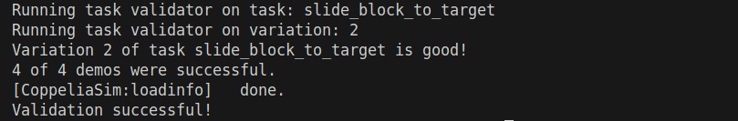


### 2. 批量化采集任务数据

#### 单任务批量采集
```bash
python -m rlbench.dataset_generator \
    --tasks slide_block_to_target \
    --episodes_per_task 4 \
    --variations 2 \
    --processes 4 \
    --save_path ./data_save/
```

#### 多任务批量采集
如果要同时生成多个任务的数据，用空格分隔任务名：
```bash
python -m rlbench.dataset_generator \
    --tasks slide_block_to_target pick_and_lift open_door \
    --episodes_per_task 4 \
    --variations 2 \
    --processes 4 \
    --save_path ./data_save/
```

**参数说明**
| 参数 | 值 | 作用 |
|------|----|------|
| `--tasks` | `slide_block_to_target` | 指定要生成数据的任务名称（这里是 `slide_block_to_target`，即“推滑块”任务）。 |
| `--episodes_per_task` | `4` | 每个任务变体（variation）采集的 **episode（轨迹）数量**。每个 episode 是一次完整的任务执行过程。 |
| `--variations` | `2` | 任务的 **变体数量**。RLBench 中许多任务有不同变体（如物体位置、颜色等随机变化）。 |
| `--processes` | `4` | 使用的 **并行进程数**，加速数据采集（多线程/多进程）。 |
| `--save_path` | `./data_save/` | 生成数据的保存路径（目录会自动创建）。 |


*如果有其他参数需要配置，可以运行以下命令查看帮助：*
```bash
python -m rlbench.dataset_generator --help
```

### 生成的数据内容
保存的每条轨迹数据包括：
- **观测数据**（如 RGB 图像、深度图、关节状态等）。
- **动作数据**（机器人的动作指令）。
- **任务元信息**（变体 ID、任务描述等）。


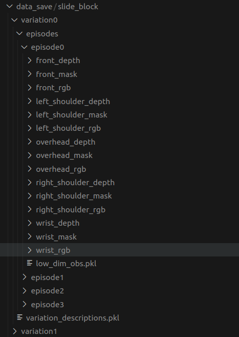


### 所采集的前视角图像示例:

RGB图:
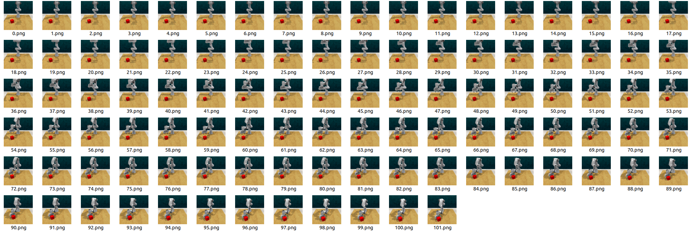

深度图:
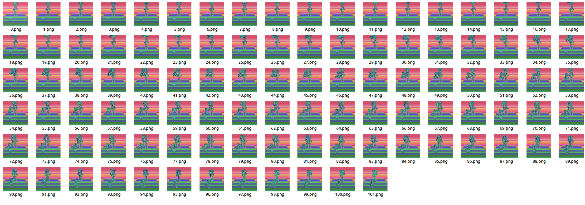

*注: 更多视角(主视角/腕部视角请自行参考采集路径)*


## 第四章: 模型训练

TODO
